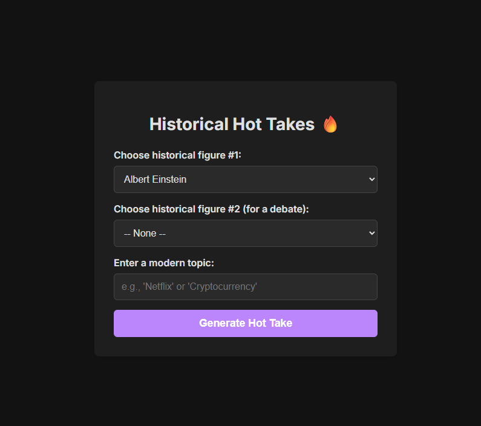

# Historical Hot Takes 🔥

A web application that uses Grok 4's action chain capabilities to generate a witty debate between two historical figures on a modern topic.

This project was created for the Vibe Coding with Grok 4 bounty.

**Powered by AI ML API**

## How it Works

This application has two modes:

### Solo Hot Take
1.  **Choose One Figure:** Select a historical figure from the first dropdown. Leave the second dropdown as "-- None --".
2.  **Enter a Topic:** Type in any modern topic.
3.  **Generate:** Click the button to get a single, witty "hot take" from your chosen figure.

### Historical Debate
1.  **Choose Two Figures:** Select two different historical figures from the dropdown lists.
2.  **Enter a Topic:** Type in any modern topic.
3.  **Generate:** Click the button to trigger an AI Action Chain:
    *   First, it generates a "hot take" from the first figure.
    *   Then, it feeds that response to the AI to generate a witty rebuttal from the second figure.
    *   The full debate is then displayed.

## Preview



## Tech Stack

This project is built with a focus on simplicity and performance, using:

*   **HTML5**
*   **CSS3** (no frameworks)
*   **Vanilla JavaScript** (ES6+)

The application makes a direct call to the AI ML API using the `fetch` API.

## How to Run

1.  **Clone the repository:**
    ```bash
    git clone https://github.com/MCbabel/Historical-Hot-Takes
    ```
2.  **Add your API Key:**
    Open the `script.js` file and replace the placeholder text `'YOUR_AI_ML_API_KEY_HERE'` with your actual AI ML API key.
3.  **Open in Browser:**
    Simply open the `index.html` file in your web browser. No build step or local server is required.


